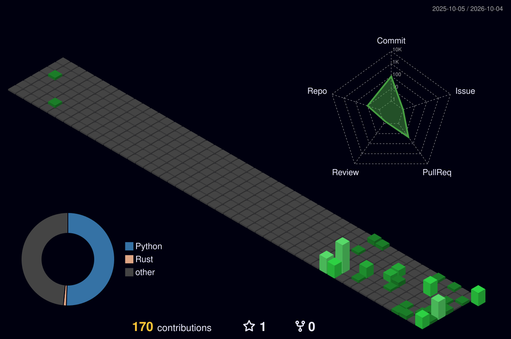

<!--
  主页 README。
  - 3D 贡献图由 .github/workflows/3d-contribute.yml 每天自动刷新
  - 游戏名片由 .github/workflows/profile-cards.yml 每10分钟自动刷新
    （明日方舟走森空岛，需仓库 Secret: SKLAND_TOKEN；终末地走 Enka，只需 UID）
  - 图片链接末尾的 ?v= 用来破 GitHub 的图片 CDN 缓存：URL 不变时 camo 会一直
    返回旧图，所以 workflow 在名片内容变化时会自动递增这个数字。不要手删。
  想改名片展示哪些数据，编辑 scripts/render.py 里的 raw_stats 即可。
  名片的底图放在 assets/arknights-bg.* 与 assets/endfield-bg.*（建议 3:1 宽图）。
-->

## 你好 

我是 FelixFan，一个喜欢折腾各种东西的vibe开发者，目前正在一中就读（坐牢）高一。

## 总览

## 游戏名片

### 明日方舟

### 明日方舟：终末地

关于这些数据的来源

- **明日方舟**：通过森空岛（Skland）账号接口获取，展示等级、入职天数、干员数量、练度分布、主线进度、理智等。
- **明日方舟：终末地**：通过 [Enka.Network](https://enka.network/?ef) 公开接口获取，展示等级、世界等级、干员/武器/档案数量等统计。

## 与我联系

- GitHub：[@FelixFan-CN](https://github.com/FelixFan-CN)
